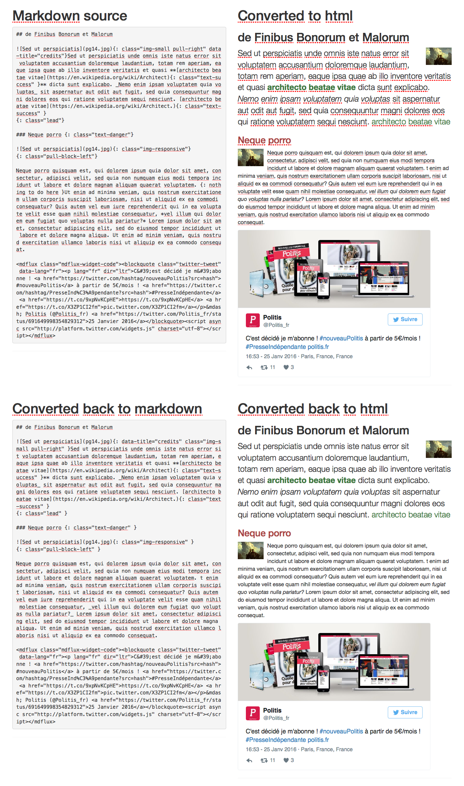

# mdFlux

Simply convert markdown to html with attribute lists (minimal support, [more informations](https://pythonhosted.org/Markdown/extensions/attr_list.html)) support and back again.
You can use any markdown to html or html to markdown parser you like.

## Dependencies

* jQuery

### Tested parsers

* [Marked](https://github.com/chjj/marked) (markdown to html)
* [to-markdown](https://github.com/domchristie/to-markdown) (html to markdown)

## Usage

    require('mdflux');

    var md = '## de Finibus Bonorum et Malorum\n\n{: class="img-half pull-right"}Sed ut perspiciatis et quasi **[architecto beatae vitae](https://en.wikipedia.org/wiki/Architect){: class="text-success" }** dicta sunt explicabo. {: class="lead"}\n\n';
    var parser = new mdFlux();

    # Set parsers
    parser.setMarkdownParser(marked);
    parser.setHTMLParser(function(html) { return toMarkdown(html, { gfm: true }) });

    # Convert to HTML
    var html = parser.toHTML(md);

    # Convert to markdown again
    md = parser.toMarkdown(html);

### Result

## Test

    $ npm install
    $ ./node_modules/.bin/browserify ./test/main.js -o ./test/bundle.js

Open ./test/index.html in your browser.

License

(MIT License)

Copyright (c) 2015 ok3z

Permission is hereby granted, free of charge, to any person obtaining a copy of this software and associated documentation files (the "Software"), to deal in the Software without restriction, including without limitation the rights to use, copy, modify, merge, publish, distribute, sublicense, and/or sell copies of the Software, and to permit persons to whom the Software is furnished to do so, subject to the following conditions:

The above copyright notice and this permission notice shall be included in all copies or substantial portions of the Software.

THE SOFTWARE IS PROVIDED "AS IS", WITHOUT WARRANTY OF ANY KIND, EXPRESS OR IMPLIED, INCLUDING BUT NOT LIMITED TO THE WARRANTIES OF MERCHANTABILITY, FITNESS FOR A PARTICULAR PURPOSE AND NONINFRINGEMENT. IN NO EVENT SHALL THE AUTHORS OR COPYRIGHT HOLDERS BE LIABLE FOR ANY CLAIM, DAMAGES OR OTHER LIABILITY, WHETHER IN AN ACTION OF CONTRACT, TORT OR OTHERWISE, ARISING FROM, OUT OF OR IN CONNECTION WITH THE SOFTWARE OR THE USE OR OTHER DEALINGS IN THE SOFTWARE.

"close your eyes, you can be a space captain"
